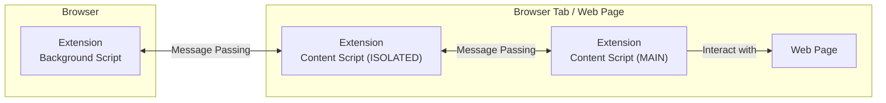

# Clear Links

This is a user experience improvement extension that reveals web links' destination in a more user-friendly and customisable tooltip, simply by moving your mouse over a link; by default, it highlights a URL's domain for links to external websites (customisable in the extension's Options menu) and thus enables more transparent links, improving explicit awareness of your navigation to an external website. One potential use case for Clear Links is to make you more easily aware of phishing email scams by allowing you to inspect a link's destination domain and allowing you to check if the destination is as expected -- identifying malicious links.

It is important to note that this extension does not identify malicious links for you, instead, it informs you of links to external sites so you can make the decision yourself. By default, links to pages within the same website/hostname do not have a tooltip appear. This can be changed in the Options menu.

In addition, this extension optionally supports automatically expanding some [shortened URLs](https://en.wikipedia.org/wiki/URL_shortening), such as those offered by Bit.ly, so you can see the full location of the web page rather than its obfuscated shortened URL.

This will make a fine addition to your security and privacy digital tool belt.

## Install

This extension is published and can be added to your browsers:

- [Firefox](https://addons.mozilla.org/en-GB/firefox/addon/clear-web-links/)
- [Chrome](https://chromewebstore.google.com/detail/clear-links/banknjcfbmhcbebgekpcenheaghfcood)

## Build

Use the Makefile with the command `make` to prepare this extension. Files are copied and prepared within the `dist/` directory.

## The Design

The extension consists of three architectural layers:

1. **Background** – The backend script handling core logic and interacting with browser APIs.
2. **Content Script (ISOLATED)** – An execution environment [isolated from the page's context](https://developer.mozilla.org/en-US/docs/Mozilla/Add-ons/WebExtensions/API/scripting/ExecutionWorld).
3. **Content Script (MAIN)** – The main script injected into webpages to interact with the DOM.

Due to the stricter security model in [Manifest V3](https://extensionworkshop.com/documentation/develop/manifest-v3-migration-guide/), direct access to `browser.*` APIs from content scripts is restricted by using isolated environments by default. For a background script to interact with a web page, [message passing](https://developer.chrome.com/docs/extensions/develop/concepts/messaging) is used; a content script added to the main execution environment forwards messages to the background script via the isolated content script, ensuring a secure communication flow.
