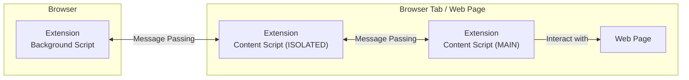

# Clear Links: A Smarter Way to Preview Web Links

<!-- markdownlint-disable MD033 -->

Clear Links is a browser extension that enhances your browsing experience by displaying a customisable tooltip when you hover over a web link. This tooltip reveals the link’s destination, helping you browse with more clarity and confidence.

## ✨ Features & Benefits

- ✅ **See Where Links Lead** – Instantly preview a link’s destination before clicking.
- ✅ **Customisable Tooltip** – Adjust appearance and behaviour in the extension’s Options menu.
- ✅ **Expand Shortened URLs** (*Optional*) – Automatically reveal full URLs for [shortened URL](https://en.wikipedia.org/wiki/URL_shortening) services like [Bit.ly](https://bitly.com/), helping you avoid hidden redirects.

By default, Clear Links only displays tooltips for links leading to external websites, ensuring you see important navigation choices. This behaviour can be customised in the extension’s settings.

A key use case for Clear Links is **phishing awareness**—by previewing a link’s destination, you can check if it matches your expectations before clicking, helping to identify potentially malicious links.

> [!NOTE]
> Clear Links does not detect malicious links for you. Instead, it provides transparent URL previews, empowering you to make informed decisions about the sites you visit.

This will make a fine addition to your security and privacy digital tool belt.

## 📥 Install

Clear Links is available for the following browsers:

## 🛠️ Build

To build the extension, use the Makefile with the command: `make`.

This will prepare the extension, with files copied and organised in the `dist/` directory.

## 🏗️ The Design

Clear Links follows a three-layer architectural model:

1. **Background** – The backend script handling core logic and interacting with browser APIs.
2. **Content Script (ISOLATED)** – A web page execution environment [isolated from the page's context](https://developer.mozilla.org/en-US/docs/Mozilla/Add-ons/WebExtensions/API/scripting/ExecutionWorld).
3. **Content Script (MAIN)** – The main script injected into webpages to interact with the DOM.

Due to the stricter security model in [Manifest V3](https://extensionworkshop.com/documentation/develop/manifest-v3-migration-guide/), direct access to `browser.*` APIs from content scripts is restricted by using isolated environments by default. For a background script to interact with a web page, [message passing](https://developer.chrome.com/docs/extensions/develop/concepts/messaging) is used; a content script added to the main execution environment forwards messages to the background script via the isolated content script, ensuring a secure communication flow.
